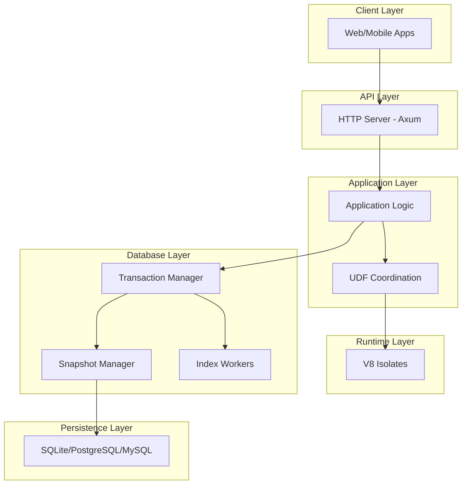
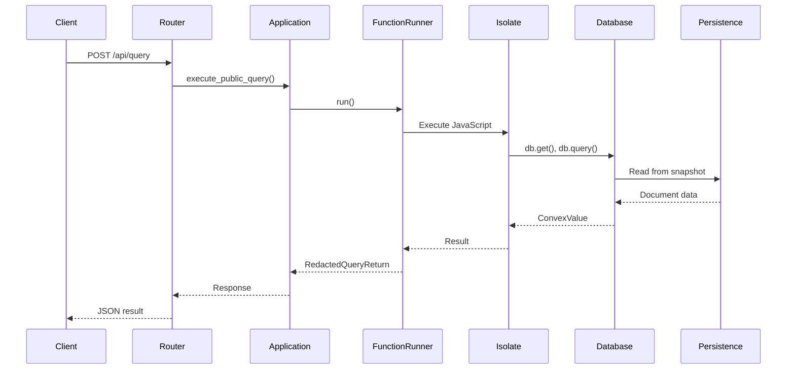
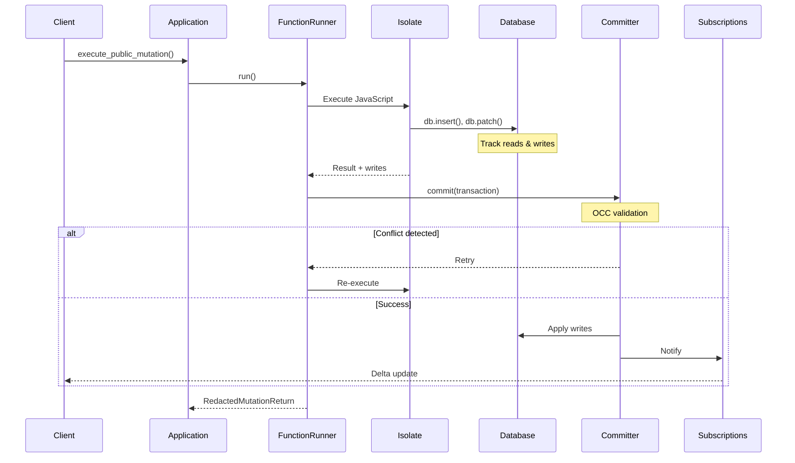

# Understanding Convex: Architecture and Core Concepts

**Part 1 of the Convex Backend Technical Series**

**Analysis Commit:** [`482df8a`](https://github.com/get-convex/convex-backend/tree/482df8a0e1288c9410be8241deb06b09d7ff70b0)

---

## What You'll Learn

- The layered architecture of Convex and why it was chosen
- Core abstractions: Runtime, Database, Application, and Isolate
- Key design decisions and their trade-offs
- How data flows through the system
- The role of each major component

---

## Introduction

Convex is a reactive database platform that automatically synchronizes data between your backend and frontend in real-time. But what does that actually mean under the hood? In this post, we'll explore the architecture that makes Convex tick.

Let's start with a simple question: what happens when your React app updates a user's profile? In a traditional setup, you'd make an API call, update a database, and hope the UI reflects the change. With Convex, every connected client sees the update instantly, consistently, and automatically.

How? Let's find out.

## The Architecture at a Glance

Convex uses a **layered architecture** with clear separation of concerns. Here's what it looks like:



This isn't just any layered architecture—each layer has a specific responsibility and a well-defined interface to the layers above and below it.

## Why This Architecture?

Before diving into the components, let's understand the constraints that shaped this design:

1. **Real-time updates**: Clients need instant notification when data changes
2. **Strong consistency**: Every read must see a consistent snapshot
3. **Secure user code**: Arbitrary JavaScript must run safely
4. **Multi-tenancy**: Support many users on shared infrastructure
5. **Developer experience**: Simple API, complex internals

These constraints led to several key design decisions:

### Trade-off 1: OCC vs. Pessimistic Locking

Convex uses **Optimistic Concurrency Control (OCC)** instead of locks. This means:

**Pros:**
- No lock contention for reads
- Better throughput for read-heavy workloads
- Simpler reasoning about deadlocks (there are none)

**Cons:**
- Transactions may need to retry on conflict
- Wasted work if conflicts are frequent
- More complex commit validation

This trade-off makes sense for Convex because most database operations are reads, and conflicts are relatively rare in typical application workloads.

### Trade-off 2: Snapshot Isolation vs. Serializability

Convex provides **snapshot isolation** rather than full serializability:

**Pros:**
- Readers never block writers
- Consistent views without locks
- Better performance for analytics queries

**Cons:**
- Write skew anomalies possible (mitigated by OCC validation)
- More complex snapshot management
- Memory overhead for multiple versions

### Trade-off 3: V8 Isolates vs. WASM

User code runs in **V8 isolates** (via Deno) rather than WASM:

**Pros:**
- Full JavaScript/TypeScript support
- Familiar development experience
- Rich ecosystem of libraries

**Cons:**
- Larger memory footprint per isolate
- V8 JIT compilation overhead
- More complex FFI boundary

## Core Abstractions

Let's explore the main abstractions that make Convex work.

### The Runtime Trait

At the foundation is the `Runtime` trait, which abstracts over async operations:

```rust
// Source: crates/common/src/runtime/mod.rs (lines 285-349)
// https://github.com/get-convex/convex-backend/blob/482df8a0e1288c9410be8241deb06b09d7ff70b0/crates/common/src/runtime/mod.rs#L285-L349

#[async_trait]
pub trait Runtime: Clone + Sync + Send + 'static {
    /// Sleep for a duration (may be virtualized in tests)
    fn wait(&self, duration: Duration)
        -> Pin<Box<dyn FusedFuture<Output = ()> + Send + 'static>>;

    /// Spawn a future with cancellation support
    fn spawn(
        &self,
        name: &'static str,
        f: impl Future<Output = ()> + Send + 'static,
    ) -> Box<dyn SpawnHandle>;

    /// Return system time (virtualized in tests)
    fn system_time(&self) -> SystemTime;

    /// Random number generator (deterministic in tests)
    fn rng(&self) -> Box<dyn RngCore>;
}
```

Why does this matter? This abstraction enables:
- **Deterministic testing**: Tests can control time and randomness
- **Simulation testing**: Complex distributed scenarios can be tested reliably
- **Production/test parity**: Same code paths with different runtimes

There are two implementations:
- `ProdRuntime`: Uses Tokio for production
- `TestRuntime`: Virtualizes time for deterministic tests

### The Database

The `Database<RT>` struct is the heart of the system:

```rust
// Source: crates/database/src/lib.rs (lines 1-200)
// https://github.com/get-convex/convex-backend/blob/482df8a0e1288c9410be8241deb06b09d7ff70b0/crates/database/src/lib.rs#L1-L200

pub struct Database<RT: Runtime> {
    committer: CommitterClient,           // Handles transaction commits
    subscriptions: SubscriptionsClient,    // Manages real-time subscriptions
    log: LogReader,                        // Access to write-ahead log
    snapshot_manager: Reader<SnapshotManager>,  // MVCC snapshots
    runtime: RT,
    reader: Arc<dyn PersistenceReader>,    // Storage backend
    retention_manager: LeaderRetentionManager<RT>,  // Garbage collection
    searcher: Arc<dyn Searcher>,           // Full-text/vector search
}
```

The database maintains:
- **Snapshots** at different timestamps for MVCC
- **Subscriptions** for real-time updates
- **Indexes** for efficient queries (including text and vector)
- **Retention** for garbage collection

### The Application

The `Application<RT>` struct coordinates everything:

```rust
// Source: crates/application/src/lib.rs (lines 544-571)
// https://github.com/get-convex/convex-backend/blob/482df8a0e1288c9410be8241deb06b09d7ff70b0/crates/application/src/lib.rs#L544-L571

pub struct Application<RT: Runtime> {
    database: Database<RT>,
    runner: Arc<ApplicationFunctionRunner<RT>>,
    function_log: FunctionExecutionLog<RT>,
    file_storage: FileStorage<RT>,
    usage_tracking: UsageCounter,
    key_broker: KeyBroker,
    instance_name: String,

    // Background workers
    scheduled_job_runner: ScheduledJobRunner,
    cron_job_executor: Arc<Mutex<Box<dyn SpawnHandle>>>,
    index_worker: Arc<Mutex<Option<Box<dyn SpawnHandle>>>>,
    search_worker: Arc<Mutex<SearchIndexWorkers>>,
    export_worker: Arc<Mutex<Option<Box<dyn SpawnHandle>>>>,
}
```

The Application:
- **Coordinates UDF execution** through the function runner
- **Manages background workers** for indexing, exports, and scheduled jobs
- **Tracks usage** for billing and rate limiting
- **Handles file storage** integration

### The ApplicationApi Trait

External interactions go through the `ApplicationApi` trait:

```rust
// Source: crates/application/src/api.rs (lines 93-250)
// https://github.com/get-convex/convex-backend/blob/482df8a0e1288c9410be8241deb06b09d7ff70b0/crates/application/src/api.rs#L93-L250

#[async_trait]
pub trait ApplicationApi: Send + Sync {
    async fn execute_public_query(
        &self,
        host: &ResolvedHostname,
        request_id: RequestId,
        identity: Identity,
        path: ExportPath,
        args: SerializedArgs,
        caller: FunctionCaller,
        ts: ExecuteQueryTimestamp,
        journal: Option<SerializedQueryJournal>,
    ) -> anyhow::Result<RedactedQueryReturn>;

    async fn execute_public_mutation(
        &self,
        host: &ResolvedHostname,
        request_id: RequestId,
        identity: Identity,
        path: ExportPath,
        args: SerializedArgs,
        caller: FunctionCaller,
        mutation_identifier: Option<SessionRequestIdentifier>,
    ) -> anyhow::Result<Result<RedactedMutationReturn, RedactedMutationError>>;

    async fn execute_http_action(
        &self,
        host: &ResolvedHostname,
        request_id: RequestId,
        http_request_metadata: HttpActionRequest,
        identity: Identity,
        caller: FunctionCaller,
        response_streamer: HttpActionResponseStreamer,
    ) -> anyhow::Result<()>;
}
```

This trait provides a clean interface for:
- Executing queries (read-only, cacheable)
- Executing mutations (read-write, transactional)
- Handling HTTP actions (custom endpoints)

## Data Flow: A Query's Journey

Let's trace what happens when a client executes a query:



The key insight here is that every database operation happens within a **transaction at a specific timestamp**. This ensures consistency—even if mutations are happening concurrently, your query sees a consistent snapshot.

## Data Flow: A Mutation's Journey

Mutations are more complex because they modify state:



Notice the **OCC validation** step. If another transaction modified data that this transaction read, the commit fails and the transaction retries. This ensures consistency without locks.

## Error Handling

Convex uses a structured error system:

```rust
// Source: crates/errors/src/lib.rs (lines 15-85)
// https://github.com/get-convex/convex-backend/blob/482df8a0e1288c9410be8241deb06b09d7ff70b0/crates/errors/src/lib.rs#L15-L85

#[derive(thiserror::Error, Clone, Debug, PartialEq, Eq)]
#[error("{msg}")]
pub struct ErrorMetadata {
    pub code: ErrorCode,
    /// Short code for metrics (e.g., "InvalidModuleName")
    pub short_msg: Cow<'static, str>,
    /// Developer-facing message
    pub msg: Cow<'static, str>,
}

pub enum ErrorCode {
    BadRequest,        // 400
    Unauthenticated,   // 401
    Forbidden,         // 403
    NotFound,          // 404
    Conflict,          // 409
    RateLimited,       // 429
    OCC { table_name, document_id, ... }, // Special
    OperationalInternalServerError,       // 500
}
```

Key features:
- **Structured codes** for programmatic handling
- **Short messages** for metrics (resilient to copy changes)
- **Detailed messages** for developers
- **OCC-specific errors** with conflict details

## Configuration Management

Configuration flows through the system at startup:

```rust
// Source: crates/local_backend/src/config.rs
// https://github.com/get-convex/convex-backend/blob/482df8a0e1288c9410be8241deb06b09d7ff70b0/crates/local_backend/src/config.rs

pub struct LocalConfig {
    db: DatabaseSpec,           // DB backend selection
    db_spec: String,            // Connection string
    name: String,               // Instance name
    http_bind_address: String,  // API port
    site_bind_address: String,  // Site port
    instance_secret: String,    // Security key
    admin_key: String,          // Admin authentication
    disable_beacon: bool,       // Telemetry opt-out
    // ... more fields
}
```

Configuration comes from:
- Command-line arguments (via clap)
- Environment variables
- Configuration files (with hot reload support)

## Crate Organization

The 64 Rust crates are organized by responsibility:

| Category | Crates | Purpose |
|----------|--------|---------|
| Core | database, application, common | Main functionality |
| Runtime | runtime, isolate | Async and JS execution |
| Persistence | postgres, mysql, sqlite | Storage backends |
| Search | search, vector, indexing | Query capabilities |
| Networking | http_client, sync, events | Communication |
| Security | authentication, keybroker | Access control |

This organization enables:
- **Clear dependencies**: Each crate has a focused purpose
- **Testability**: Smaller units are easier to test
- **Compilation speed**: Parallel crate compilation

## Key Takeaways

1. **Layered architecture with clear boundaries** - Each layer has a well-defined API and responsibility

2. **OCC for consistency without locks** - Transactions validate at commit time, retry on conflict

3. **Runtime abstraction enables testing** - Same code, different runtimes for prod vs test

4. **Trait-based polymorphism** - `ApplicationApi`, `Persistence`, `Storage` traits enable flexibility

5. **Structured error handling** - Rich error metadata for debugging and metrics

## What's Next?

In the next post, we'll dive deep into the database engine—how snapshots work, how transactions are validated, and how Convex achieves strong consistency with high performance.

---

## References

- [Database README](https://github.com/get-convex/convex-backend/blob/482df8a0e1288c9410be8241deb06b09d7ff70b0/crates/database/README.md)
- [Isolate README](https://github.com/get-convex/convex-backend/blob/482df8a0e1288c9410be8241deb06b09d7ff70b0/crates/isolate/README.md)
- [Contributing Guide](https://github.com/get-convex/convex-backend/blob/482df8a0e1288c9410be8241deb06b09d7ff70b0/CONTRIBUTING.md)

---

*Next: [Part 2 - Deep Dive: The Convex Database Engine](02-deep-dive-database.md)*
