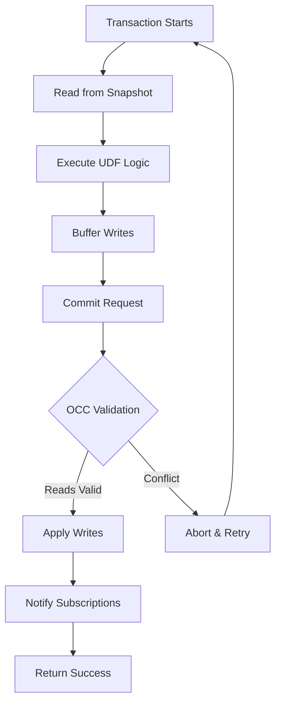

# Deep Dive: The Convex Database Engine

**Part 2 of the Convex Backend Technical Series**

**Analysis Commit:** [`482df8a`](https://github.com/get-convex/convex-backend/tree/482df8a0e1288c9410be8241deb06b09d7ff70b0)

---

## What You'll Learn

- How Convex implements MVCC (Multi-Version Concurrency Control)
- The OCC transaction lifecycle: begin, execute, validate, commit
- How snapshot isolation prevents anomalies
- Conflict detection and automatic retry mechanisms
- The persistence layer abstraction

---

## Introduction

In the previous post, we explored Convex's architecture. Now let's dive into the heart of the system: the database engine. This is where the magic happens—where reads are consistent, writes are atomic, and everything stays in sync.

The Convex database is a custom implementation optimized for:
- **Real-time subscriptions** (not an afterthought)
- **JavaScript UDF execution** (tight integration)
- **Multi-tenancy** (shared infrastructure)

Let's see how it works.

## The SnapshotManager: MVCC in Action

MVCC allows multiple readers to access consistent snapshots while writers create new versions. The `SnapshotManager` is the core of this system:

```rust
// Conceptual structure based on crates/database/src/snapshot_manager.rs
// https://github.com/get-convex/convex-backend/blob/482df8a0e1288c9410be8241deb06b09d7ff70b0/crates/database/src/snapshot_manager.rs

pub struct SnapshotManager {
    // Snapshots indexed by timestamp
    snapshots: BTreeMap<Timestamp, Snapshot>,

    // Current maximum timestamp
    latest_ts: Timestamp,

    // Minimum timestamp for retention
    min_snapshot_ts: Timestamp,
}

pub struct Snapshot {
    // Table data at this timestamp
    table_mapping: TableMapping,

    // Index data at this timestamp
    index_registry: IndexRegistry,

    // In-memory document cache
    in_memory_indexes: InMemoryIndexes,
}
```

When you start a transaction, you get a snapshot at a specific timestamp. All your reads come from that snapshot, giving you a consistent view even as other transactions commit.

### Timestamp Management

Convex uses logical timestamps, not wall-clock time:

```rust
// Source: crates/common/src/types/timestamp.rs
// https://github.com/get-convex/convex-backend/blob/482df8a0e1288c9410be8241deb06b09d7ff70b0/crates/common/src/types/timestamp.rs

#[derive(Copy, Clone, Debug, Eq, PartialEq, Ord, PartialOrd)]
pub struct Timestamp(u64);

#[derive(Copy, Clone, Debug)]
pub struct RepeatableTimestamp(Timestamp);

#[derive(Copy, Clone, Debug)]
pub struct WriteTimestamp(Timestamp);
```

- **Timestamp**: A logical point in time
- **RepeatableTimestamp**: Guaranteed stable for reads
- **WriteTimestamp**: Assigned when a transaction commits

This separation matters. A `RepeatableTimestamp` means "you can read from this timestamp and get the same results every time." The database maintains this invariant.

## The Transaction: Where Consistency Lives

The `Transaction` struct tracks everything during execution:

```rust
// Source: crates/database/src/transaction.rs (lines 1-150)
// https://github.com/get-convex/convex-backend/blob/482df8a0e1288c9410be8241deb06b09d7ff70b0/crates/database/src/transaction.rs#L1-L150

pub struct Transaction<RT: Runtime> {
    // Who is executing this transaction
    pub(crate) identity: Identity,

    // All reads performed (for OCC validation)
    read_set: ReadSet,

    // All writes to apply
    writes: NestedWrites,

    // Snapshot we're reading from
    snapshot: Snapshot,

    // Index management
    transaction_index: TransactionIndex,

    // Usage tracking for billing
    usage_tracker: FunctionUsageTracker,

    // Timestamp we're reading at
    begin_timestamp: RepeatableTimestamp,
}
```

### The ReadSet: Tracking Dependencies

The `ReadSet` records everything the transaction reads:

```rust
// Conceptual structure
pub struct ReadSet {
    // Tables we've read from
    tables: BTreeSet<TableId>,

    // Specific documents we've accessed
    documents: BTreeMap<DocumentId, Timestamp>,

    // Index ranges we've scanned
    index_ranges: Vec<IndexRange>,
}
```

Why track reads? For OCC validation. At commit time, we check: "Did any of these reads change since we started?" If yes, we have a conflict.

### The Writes: Buffered Changes

Writes are buffered until commit:

```rust
// Conceptual structure
pub struct Writes {
    // Documents to insert/update
    updates: BTreeMap<DocumentId, DocumentUpdate>,

    // Documents to delete
    deletes: BTreeSet<DocumentId>,
}

pub enum DocumentUpdate {
    Insert(ConvexObject),
    Replace(ConvexObject),
    Patch(PatchOperations),
}
```

This buffering is crucial—it means:
- Writes aren't visible until commit
- Aborted transactions leave no trace
- We can validate before persisting

## OCC: The Heart of Consistency

Here's how OCC validation works:



### Validation Steps

1. **Read Consistency**: Check that nothing we read has been modified
2. **Write Conflicts**: Check that documents we're writing weren't written by others
3. **Index Consistency**: Verify index constraints still hold

```rust
// Conceptual validation logic
// Source: crates/database/src/committer.rs
// https://github.com/get-convex/convex-backend/blob/482df8a0e1288c9410be8241deb06b09d7ff70b0/crates/database/src/committer.rs

async fn validate_transaction(
    &self,
    transaction: &Transaction<RT>,
    commit_ts: WriteTimestamp,
) -> Result<(), ConflictError> {
    // Check each read is still valid at commit time
    for (doc_id, read_ts) in transaction.read_set.documents() {
        let current_ts = self.get_document_timestamp(doc_id).await?;
        if current_ts > read_ts {
            return Err(ConflictError::DocumentModified {
                document_id: doc_id,
                read_at: read_ts,
                modified_at: current_ts,
            });
        }
    }

    // Check write targets haven't been modified
    for doc_id in transaction.writes.affected_documents() {
        let current_ts = self.get_document_timestamp(doc_id).await?;
        if current_ts > transaction.begin_timestamp {
            return Err(ConflictError::WriteConflict {
                document_id: doc_id,
            });
        }
    }

    Ok(())
}
```

### Conflict Resolution

When a conflict is detected, the transaction automatically retries:

```rust
// Source: crates/common/src/backoff.rs
// https://github.com/get-convex/convex-backend/blob/482df8a0e1288c9410be8241deb06b09d7ff70b0/crates/common/src/backoff.rs

pub struct Backoff {
    initial_backoff: Duration,
    max_backoff: Duration,
    attempts: u32,
}

impl Backoff {
    pub fn next_backoff(&mut self) -> Duration {
        let backoff = self.initial_backoff * 2u32.pow(self.attempts);
        let capped = backoff.min(self.max_backoff);

        // Add jitter to prevent thundering herd
        let jitter = rand::thread_rng().gen_range(0.0..1.0);
        self.attempts += 1;

        capped.mul_f64(jitter)
    }
}
```

The exponential backoff with jitter prevents:
- **Thundering herd**: All retries hitting at once
- **Livelock**: Transactions repeatedly conflicting

## Persistence: The Storage Backend

Convex abstracts storage through the `Persistence` trait:

```rust
// Source: crates/common/src/persistence.rs
// https://github.com/get-convex/convex-backend/blob/482df8a0e1288c9410be8241deb06b09d7ff70b0/crates/common/src/persistence.rs

#[async_trait]
pub trait PersistenceReader: Send + Sync + 'static {
    /// Load documents from a table at a timestamp
    async fn load_documents(
        &self,
        table_id: TableId,
        timestamp: Timestamp,
    ) -> anyhow::Result<Vec<Document>>;

    /// Load index entries
    async fn index_scan(
        &self,
        index_id: IndexId,
        range: IndexRange,
        timestamp: Timestamp,
    ) -> anyhow::Result<Vec<IndexEntry>>;
}

#[async_trait]
pub trait PersistenceWriter: Send + Sync + 'static {
    /// Write documents atomically
    async fn write_documents(
        &self,
        documents: Vec<DocumentWrite>,
        timestamp: WriteTimestamp,
    ) -> anyhow::Result<()>;
}
```

Implementations exist for:
- **SQLite** (default for local development)
- **PostgreSQL** (recommended for production)
- **MySQL** (alternative)

### Document Storage Model

Documents are stored with version information:

```rust
// Conceptual storage structure
pub struct StoredDocument {
    // Unique identifier
    id: DocumentId,

    // Table this belongs to
    table_id: TableId,

    // The actual data
    value: ConvexObject,

    // When this version was created
    creation_time: Timestamp,

    // Previous version timestamp (for MVCC)
    prev_ts: Option<Timestamp>,
}
```

The `prev_ts` pointer enables:
- **Version traversal**: Walk back through history
- **Garbage collection**: Know what can be deleted
- **Conflict detection**: Compare version chains

## Indexes: Fast Access Paths

Convex supports several index types:

### Database Indexes

Standard B-tree indexes for efficient lookups:

```rust
// Conceptual index definition
pub struct DatabaseIndex {
    id: IndexId,
    table_id: TableId,
    fields: Vec<FieldPath>,
    is_unique: bool,
}
```

### Text Search Indexes

Full-text search powered by Tantivy:

```rust
// Source: crates/search/src/lib.rs
// https://github.com/get-convex/convex-backend/blob/482df8a0e1288c9410be8241deb06b09d7ff70b0/crates/search/src/lib.rs

pub struct TextSearchIndex {
    // Tantivy index instance
    tantivy_index: tantivy::Index,

    // Field configuration
    searchable_fields: Vec<String>,
    filter_fields: Vec<String>,
}
```

### Vector Indexes

Semantic search with embeddings:

```rust
// Source: crates/vector/src/lib.rs
// https://github.com/get-convex/convex-backend/blob/482df8a0e1288c9410be8241deb06b09d7ff70b0/crates/vector/src/lib.rs

pub struct VectorIndex {
    // Qdrant segment for vector operations
    segment: qdrant_segment::Segment,

    // Embedding dimension
    dimensions: usize,
}
```

## Index Workers: Background Processing

Indexes are updated asynchronously by workers:

```rust
// Source: crates/database/src/database.rs
// https://github.com/get-convex/convex-backend/blob/482df8a0e1288c9410be8241deb06b09d7ff70b0/crates/database/src/database.rs

impl<RT: Runtime> Database<RT> {
    pub fn start_index_workers(&self) {
        // Text search indexing
        let text_worker = self.runtime.spawn(
            "text_index_worker",
            self.text_index_flusher.run()
        );

        // Vector indexing
        let vector_worker = self.runtime.spawn(
            "vector_index_worker",
            self.vector_index_flusher.run()
        );

        // Fast-forward for lag reduction
        let ff_worker = self.runtime.spawn(
            "fast_forward_worker",
            self.fast_forward_worker.run()
        );
    }
}
```

This async approach means:
- **Commits aren't blocked** by index updates
- **Indexes eventually consistent** with data
- **Background throughput optimization**

## Query Execution

Let's trace a query through the database:

```rust
// Pseudocode for query execution
async fn execute_query(
    &self,
    query: DatabaseQuery,
) -> anyhow::Result<Vec<Document>> {
    // 1. Get a snapshot at current timestamp
    let snapshot = self.snapshot_manager.latest_snapshot();

    // 2. Start a read-only transaction
    let tx = Transaction::new_read_only(snapshot);

    // 3. Plan the query
    let plan = self.query_planner.plan(&query, &tx)?;

    // 4. Execute using best index
    let results = match plan {
        QueryPlan::IndexScan { index, range } => {
            tx.index_scan(index, range).await?
        }
        QueryPlan::TableScan { table } => {
            tx.table_scan(table).await?
        }
    };

    // 5. Apply filters and limits
    let filtered = results
        .into_iter()
        .filter(|doc| query.filter.matches(doc))
        .take(query.limit)
        .collect();

    Ok(filtered)
}
```

## Retention: Garbage Collection

Old versions need cleanup. The retention system handles this:

```rust
// Source: crates/database/src/retention.rs
// https://github.com/get-convex/convex-backend/blob/482df8a0e1288c9410be8241deb06b09d7ff70b0/crates/database/src/retention.rs

pub struct RetentionManager<RT: Runtime> {
    // Minimum timestamp to retain
    min_snapshot_ts: Timestamp,

    // Rate limiter to avoid overwhelming storage
    rate_limiter: RateLimiter<RT>,
}

impl<RT: Runtime> RetentionManager<RT> {
    pub async fn cleanup_old_versions(&self) -> anyhow::Result<u64> {
        let cutoff = self.min_snapshot_ts;

        // Delete document versions older than cutoff
        let deleted = self.persistence
            .delete_documents_before(cutoff)
            .await?;

        // Delete index entries
        self.persistence
            .delete_index_entries_before(cutoff)
            .await?;

        Ok(deleted)
    }
}
```

The retention manager:
- **Respects active snapshots** (don't delete what's in use)
- **Rate limits** to avoid I/O storms
- **Tracks progress** for observability

## Performance Characteristics

### Strengths

1. **Read performance**: Snapshot reads never block
2. **Write throughput**: OCC reduces contention
3. **Real-time latency**: Subscriptions are first-class

### Trade-offs

1. **Retry overhead**: Conflicts require re-execution
2. **Memory for snapshots**: Multiple versions in memory
3. **Background lag**: Indexes may be slightly behind

### Optimization Opportunities

From our analysis, we identified these improvement areas:

1. **Search + filter performance** (TODO at `search/src/query.rs:1011`)
2. **Edit distance scoring** (multiple TODOs in search)
3. **Arc<Mutex> contention** in usage tracking

## Key Takeaways

1. **MVCC enables concurrent reads** - Readers never block writers

2. **OCC validates at commit** - No locks, automatic retries

3. **Snapshots are immutable** - Consistent views guaranteed

4. **Persistence is pluggable** - SQLite/PostgreSQL/MySQL

5. **Indexes are async** - Writes fast, indexes eventually consistent

## What's Next?

In the next post, we'll explore the design patterns used throughout Convex: the runtime trait, error handling, async patterns, and testing strategies.

---

## References

- [Database Architecture README](https://github.com/get-convex/convex-backend/blob/482df8a0e1288c9410be8241deb06b09d7ff70b0/crates/database/README.md)
- [Transaction Implementation](https://github.com/get-convex/convex-backend/blob/482df8a0e1288c9410be8241deb06b09d7ff70b0/crates/database/src/transaction.rs)
- [Committer Implementation](https://github.com/get-convex/convex-backend/blob/482df8a0e1288c9410be8241deb06b09d7ff70b0/crates/database/src/committer.rs)

---

*Next: [Part 3 - Patterns and Practices in Convex](03-patterns-practices.md)*
