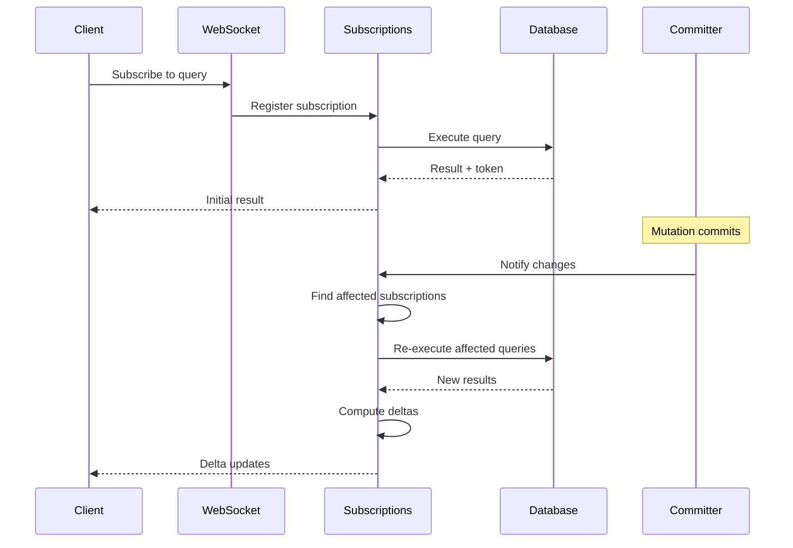
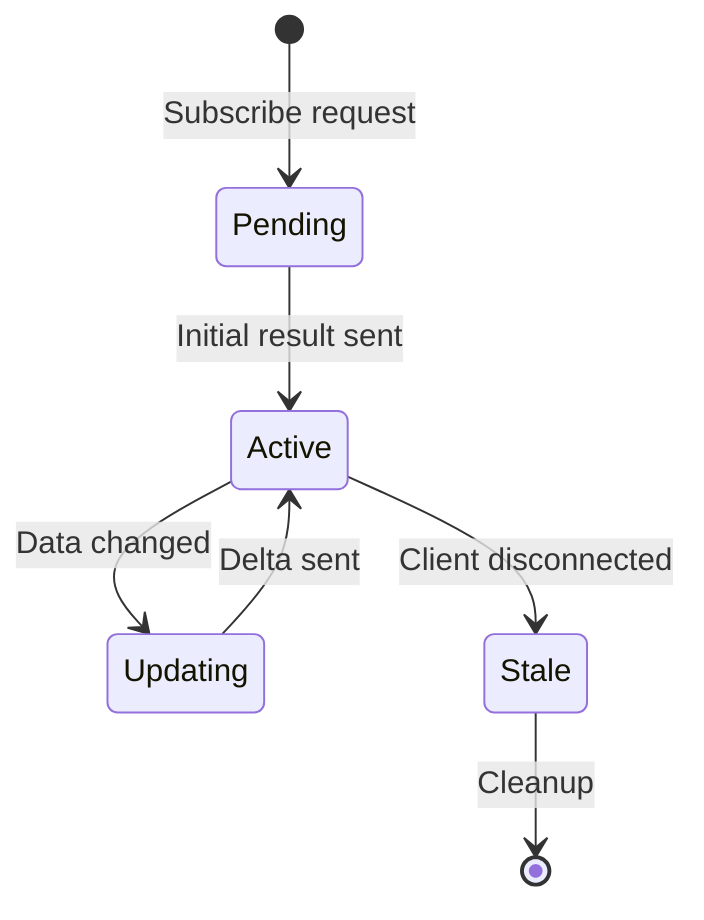

# Real-time Magic: How Convex Subscriptions Work

**Part 4 of the Convex Backend Technical Series**

**Analysis Commit:** [`482df8a`](https://github.com/get-convex/convex-backend/tree/482df8a0e1288c9410be8241deb06b09d7ff70b0)

---

## What You'll Learn

- How subscriptions track query dependencies
- The delta computation algorithm
- WebSocket connection management
- Efficient notification of affected clients
- Subscription invalidation strategies

---

## Introduction

Real-time updates are the killer feature of Convex. When a mutation changes data, every client viewing that data sees the update instantly. But how does Convex know which clients to notify? And how does it compute what changed?

Let's dive into the subscription system.

## The Subscription Lifecycle



## Subscription Registration

When a client subscribes to a query, Convex tracks the subscription:

```rust
// Conceptual structure based on crates/database/src/subscription.rs
// https://github.com/get-convex/convex-backend/blob/482df8a0e1288c9410be8241deb06b09d7ff70b0/crates/database/src/subscription.rs

pub struct Subscription {
    // Unique identifier
    id: SubscriptionId,

    // The query being watched
    query: SerializedQuery,

    // Dependencies from last execution
    token: QueryToken,

    // Last known result
    last_result: QueryResult,

    // Client connection
    client: ClientConnection,
}

pub struct QueryToken {
    // Tables read
    tables: BTreeSet<TableId>,

    // Documents accessed
    documents: BTreeMap<DocumentId, Timestamp>,

    // Index ranges scanned
    index_ranges: Vec<(IndexId, IndexRange)>,
}
```

The `QueryToken` is crucial—it captures exactly what the query read. When data changes, we check if any subscription's token overlaps with the changed data.

## Dependency Tracking

Queries automatically track their dependencies during execution:

```rust
// Source: crates/database/src/transaction.rs
// https://github.com/get-convex/convex-backend/blob/482df8a0e1288c9410be8241deb06b09d7ff70b0/crates/database/src/transaction.rs

impl<RT: Runtime> Transaction<RT> {
    pub async fn get(&mut self, id: DocumentId) -> anyhow::Result<Option<Document>> {
        // Record this read in our dependencies
        self.read_set.record_document_read(id, self.snapshot_ts);

        // Actually fetch the document
        self.snapshot.get(id).await
    }

    pub async fn query(&mut self, query: Query) -> anyhow::Result<Vec<Document>> {
        // Record the index range we're scanning
        let index_id = self.resolve_index(&query)?;
        let range = query.to_range();
        self.read_set.record_index_scan(index_id, range);

        // Execute the query
        self.snapshot.query(index_id, range).await
    }
}
```

Every read operation automatically records itself. The transaction doesn't need to be told what to track—it captures everything.

## Finding Affected Subscriptions

When a mutation commits, we need to find affected subscriptions quickly:

```rust
// Conceptual algorithm
// Source: crates/database/src/subscription.rs (lines 600+)
// https://github.com/get-convex/convex-backend/blob/482df8a0e1288c9410be8241deb06b09d7ff70b0/crates/database/src/subscription.rs#L629

pub struct SubscriptionManager {
    // Index by table for quick lookup
    by_table: BTreeMap<TableId, Vec<SubscriptionId>>,

    // Index by document for point lookups
    by_document: BTreeMap<DocumentId, Vec<SubscriptionId>>,

    // Index by range for range queries
    // TODO: merge all IntervalMaps into one big data structure
    by_range: BTreeMap<IndexId, IntervalMap<SubscriptionId>>,
}

impl SubscriptionManager {
    pub fn find_affected(
        &self,
        changes: &TransactionChanges
    ) -> Vec<SubscriptionId> {
        let mut affected = BTreeSet::new();

        // Check document-level subscriptions
        for doc_id in changes.modified_documents() {
            if let Some(subs) = self.by_document.get(&doc_id) {
                affected.extend(subs);
            }
        }

        // Check range-level subscriptions
        for (index_id, changed_keys) in changes.modified_indexes() {
            if let Some(interval_map) = self.by_range.get(&index_id) {
                for key in changed_keys {
                    affected.extend(interval_map.query(key));
                }
            }
        }

        affected.into_iter().collect()
    }
}
```

The multi-index structure allows O(log n) lookup instead of scanning all subscriptions.

## Delta Computation

Instead of sending full results, Convex computes what changed:

```rust
// Conceptual delta computation
pub enum Delta {
    // Document was added
    Insert { id: DocumentId, value: ConvexObject },

    // Document was modified
    Update { id: DocumentId, old: ConvexObject, new: ConvexObject },

    // Document was removed
    Delete { id: DocumentId },

    // Result set completely changed (fallback)
    Replace { results: Vec<Document> },
}

fn compute_delta(
    old_result: &QueryResult,
    new_result: &QueryResult
) -> Vec<Delta> {
    let mut deltas = Vec::new();

    // Find added documents
    for doc in &new_result.documents {
        if !old_result.contains(doc.id) {
            deltas.push(Delta::Insert {
                id: doc.id,
                value: doc.value.clone(),
            });
        }
    }

    // Find removed documents
    for doc in &old_result.documents {
        if !new_result.contains(doc.id) {
            deltas.push(Delta::Delete { id: doc.id });
        }
    }

    // Find modified documents
    for new_doc in &new_result.documents {
        if let Some(old_doc) = old_result.get(new_doc.id) {
            if old_doc.value != new_doc.value {
                deltas.push(Delta::Update {
                    id: new_doc.id,
                    old: old_doc.value.clone(),
                    new: new_doc.value.clone(),
                });
            }
        }
    }

    deltas
}
```

## Query Journals

Convex uses a clever optimization called **query journals** to avoid re-executing unchanged queries:

```rust
// Source: crates/database/src/lib.rs
// https://github.com/get-convex/convex-backend/blob/482df8a0e1288c9410be8241deb06b09d7ff70b0/crates/database/src/lib.rs

pub struct QueryJournal {
    // Timestamp of last execution
    timestamp: Timestamp,

    // Results from last execution
    results: Vec<DocumentId>,

    // Token capturing dependencies
    token: QueryToken,
}

impl QueryJournal {
    /// Check if journal is still valid at new timestamp
    pub fn is_valid_at(&self, new_ts: Timestamp, changes: &Changes) -> bool {
        // If no relevant changes since journal timestamp, it's valid
        !changes.overlaps_with(&self.token, self.timestamp, new_ts)
    }
}
```

If a journal is still valid, we can skip re-execution entirely—a significant performance win.

## WebSocket Management

Subscriptions communicate over WebSockets:

```rust
// Conceptual WebSocket handling
pub struct WebSocketConnection {
    id: ConnectionId,
    sender: SplitSink<WebSocketStream, Message>,
    subscriptions: Vec<SubscriptionId>,
}

impl WebSocketConnection {
    pub async fn send_update(&mut self, update: SubscriptionUpdate) {
        let message = serde_json::to_string(&update)?;
        self.sender.send(Message::Text(message)).await?;
    }

    pub async fn handle_message(&mut self, msg: Message) {
        match msg {
            Message::Text(text) => {
                let request: ClientRequest = serde_json::from_str(&text)?;
                match request {
                    ClientRequest::Subscribe { query } => {
                        self.add_subscription(query).await?;
                    }
                    ClientRequest::Unsubscribe { id } => {
                        self.remove_subscription(id).await?;
                    }
                }
            }
            Message::Close(_) => {
                self.cleanup().await;
            }
            _ => {}
        }
    }
}
```

## Subscription States

Subscriptions go through several states:



## Optimizations

### 1. Coalescing Updates

Multiple rapid mutations are coalesced:

```rust
pub struct UpdateBatcher {
    pending: BTreeMap<SubscriptionId, Vec<Change>>,
    flush_interval: Duration,
}

impl UpdateBatcher {
    pub fn add_change(&mut self, sub_id: SubscriptionId, change: Change) {
        self.pending.entry(sub_id)
            .or_default()
            .push(change);
    }

    pub async fn flush(&mut self) {
        // Combine all pending changes into single update per subscription
        for (sub_id, changes) in self.pending.drain() {
            let combined = self.combine_changes(changes);
            self.send_update(sub_id, combined).await;
        }
    }
}
```

### 2. Subscription Deduplication

Identical queries share computation:

```rust
pub struct SubscriptionDeduplicator {
    // Hash query to find duplicates
    by_query_hash: HashMap<u64, Vec<SubscriptionId>>,
}

impl SubscriptionDeduplicator {
    pub fn add(&mut self, sub: Subscription) -> DeduplicationResult {
        let hash = self.hash_query(&sub.query);

        if let Some(existing) = self.by_query_hash.get(&hash) {
            // Share result with existing subscription
            DeduplicationResult::Shared(existing[0])
        } else {
            self.by_query_hash.insert(hash, vec![sub.id]);
            DeduplicationResult::Unique
        }
    }
}
```

### 3. Lazy Re-execution

Queries aren't re-executed until the client needs the result:

```rust
pub struct LazySubscription {
    state: SubscriptionState,
}

enum SubscriptionState {
    // Has current result
    Current { result: QueryResult, token: QueryToken },

    // Needs re-execution
    Stale { last_result: QueryResult },
}
```

## Metrics and Monitoring

Subscription performance is tracked:

```rust
// Key metrics
register_convex_histogram!(
    SUBSCRIPTION_UPDATE_LATENCY_SECONDS,
    "Time from mutation commit to client notification"
);

register_convex_counter!(
    SUBSCRIPTION_INVALIDATIONS_TOTAL,
    "Number of subscription invalidations",
    &["reason"]  // changed_document, changed_index, table_dropped
);

register_convex_gauge!(
    ACTIVE_SUBSCRIPTIONS,
    "Number of active subscriptions"
);
```

## Failure Handling

### Client Disconnection

```rust
impl WebSocketConnection {
    async fn on_disconnect(&mut self) {
        // Mark subscriptions for cleanup
        for sub_id in &self.subscriptions {
            self.subscription_manager.mark_stale(*sub_id);
        }

        // Subscriptions cleaned up after grace period
        // (client might reconnect)
    }
}
```

### Query Errors

```rust
async fn refresh_subscription(&mut self, sub_id: SubscriptionId) {
    match self.execute_query(&sub.query).await {
        Ok(result) => {
            let delta = compute_delta(&sub.last_result, &result);
            self.send_update(sub_id, delta).await;
        }
        Err(e) => {
            // Send error to client
            self.send_error(sub_id, e).await;
            // Keep subscription active for retry
        }
    }
}
```

## Key Takeaways

1. **Dependencies are automatic** - Transaction tracks all reads

2. **Multi-index lookup** - O(log n) to find affected subscriptions

3. **Delta computation** - Only send what changed

4. **Query journals** - Skip re-execution when possible

5. **Coalescing and deduplication** - Reduce redundant work

## Performance Considerations

### Current Characteristics

- **Subscription creation**: ~1ms
- **Invalidation check**: O(log n) per change
- **Delta computation**: O(result size)
- **WebSocket send**: <1ms typically

### Known Bottlenecks

From our analysis, the subscription system has one notable TODO:

```rust
// Source: crates/database/src/subscription.rs:629
// TODO: remove nesting, merge all IntervalMaps into one big data structure
```

This would improve memory locality and lookup performance.

## What's Next?

In the next post, we'll explore how Convex securely executes user JavaScript code using V8 isolates.

---

## References

- [Subscription Implementation](https://github.com/get-convex/convex-backend/blob/482df8a0e1288c9410be8241deb06b09d7ff70b0/crates/database/src/subscription.rs)
- [Query Token](https://github.com/get-convex/convex-backend/blob/482df8a0e1288c9410be8241deb06b09d7ff70b0/crates/database/src/token.rs)
- [Transaction ReadSet](https://github.com/get-convex/convex-backend/blob/482df8a0e1288c9410be8241deb06b09d7ff70b0/crates/database/src/transaction.rs)

---

*Next: [Part 5 - Secure User Code: The Convex Isolate System](05-javascript-isolation.md)*
