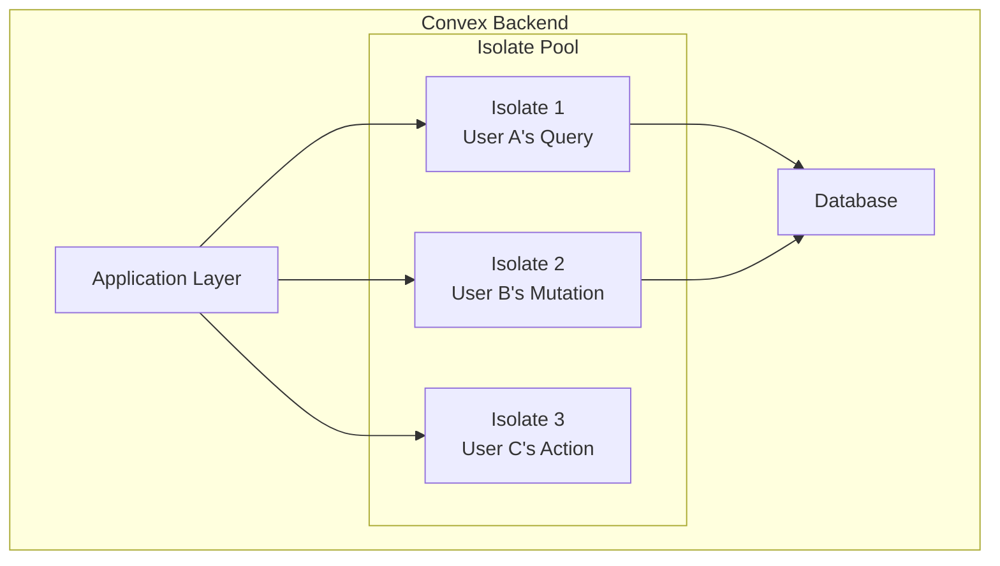
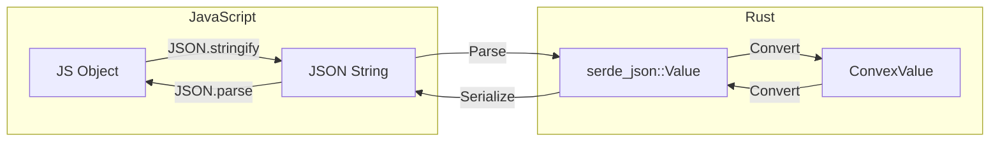

# Secure User Code: The Convex Isolate System

**Part 5 of the Convex Backend Technical Series**

**Analysis Commit:** [`482df8a`](https://github.com/get-convex/convex-backend/tree/482df8a0e1288c9410be8241deb06b09d7ff70b0)

---

## What You'll Learn

- How V8 isolates provide security boundaries
- The syscall interface between JavaScript and Rust
- Data serialization between languages
- Resource limits and timeout enforcement
- The UDF execution lifecycle

---

## Introduction

Convex runs your JavaScript/TypeScript code on the server. But how do you run arbitrary user code safely? You can't just `eval()` it and hope for the best.

The answer is **V8 isolates**—the same technology that powers Chrome tabs and Cloudflare Workers. Let's see how Convex uses them.

## The Isolation Model

Each UDF execution gets its own isolate:



Isolates provide:
- **Memory isolation** - Can't access other isolates' data
- **CPU isolation** - Can be terminated if they run too long
- **Network isolation** - No direct network access

## The Deno Core Integration

Convex uses Deno Core, the runtime layer of the Deno project:

```rust
// Source: crates/isolate/src/isolate.rs
// https://github.com/get-convex/convex-backend/blob/482df8a0e1288c9410be8241deb06b09d7ff70b0/crates/isolate/src/isolate.rs

use deno_core::{
    JsRuntime,
    RuntimeOptions,
    v8,
};

pub struct ConvexIsolate {
    runtime: JsRuntime,
    syscall_trace: SyscallTrace,
}

impl ConvexIsolate {
    pub fn new(options: IsolateOptions) -> anyhow::Result<Self> {
        let runtime = JsRuntime::new(RuntimeOptions {
            // Custom ops for Convex syscalls
            extensions: vec![convex_ops::init_ops()],

            // Memory limits
            create_params: Some(
                v8::CreateParams::default()
                    .heap_limits(0, options.max_heap_size)
            ),

            // No built-in modules
            module_loader: None,

            ..Default::default()
        })?;

        Ok(Self { runtime, syscall_trace: Default::default() })
    }
}
```

## The Syscall Interface

User code can't access the database directly. Instead, it calls **syscalls** that the Rust side implements:

```rust
// Source: crates/isolate/src/ops/mod.rs
// https://github.com/get-convex/convex-backend/blob/482df8a0e1288c9410be8241deb06b09d7ff70b0/crates/isolate/src/ops/mod.rs

deno_core::extension!(
    convex_ops,
    ops = [
        // Database operations
        op_db_get,
        op_db_insert,
        op_db_patch,
        op_db_delete,
        op_db_query,

        // System operations
        op_console_log,
        op_get_auth,
        op_schedule,

        // Storage operations
        op_storage_get_url,
        op_storage_store,
    ],
);

#[op]
async fn op_db_get(
    state: &mut OpState,
    table: String,
    id: String,
) -> Result<Option<serde_json::Value>, AnyError> {
    let ctx = state.borrow::<ExecutionContext>();
    let doc_id = DocumentId::parse(&id)?;

    let result = ctx.transaction
        .get(doc_id)
        .await?
        .map(|doc| doc.to_json());

    Ok(result)
}
```

On the JavaScript side:

```typescript
// User-facing API (simplified)
export const db = {
  async get<T>(id: Id<T>): Promise<T | null> {
    return Convex.syscall("db_get", { table: id.tableName, id: id.id });
  },

  async insert<T>(table: string, value: T): Promise<Id<T>> {
    return Convex.syscall("db_insert", { table, value });
  },
};
```

## Data Serialization

Data flows between Rust and JavaScript through serialization:



The isolate README documents this process:

```rust
// Source: crates/isolate/README.md
// https://github.com/get-convex/convex-backend/blob/482df8a0e1288c9410be8241deb06b09d7ff70b0/crates/isolate/README.md

// Serialization flow:
// 1. Browser sends JSON-serializable objects
// 2. Convex replaces/revives custom types (Id, etc.)
// 3. Rust deserializes to ConvexValue
// 4. Pass to Deno/V8 as JSON string
// 5. V8 revives back to JavaScript object
// 6. UDF code executes
// 7. Return value follows reverse path
```

### Special Type Handling

Convex types need special serialization:

```rust
// ConvexValue types
pub enum ConvexValue {
    Null,
    Boolean(bool),
    Integer(i64),
    Float(f64),
    String(String),
    Bytes(Vec<u8>),
    Array(Vec<ConvexValue>),
    Object(BTreeMap<String, ConvexValue>),
    Id(DocumentId),  // Special!
}

// Serialized as JSON with type markers
// { "$id": "users:abc123" }
// { "$bytes": "base64encoded..." }
```

## Resource Limits

Isolates are constrained to prevent abuse:

```rust
// Source: crates/isolate/src/environment/mod.rs
// https://github.com/get-convex/convex-backend/blob/482df8a0e1288c9410be8241deb06b09d7ff70b0/crates/isolate/src/environment/mod.rs

pub struct ResourceLimits {
    // Memory
    pub max_heap_size: usize,         // Default: 64MB

    // Time
    pub max_execution_time: Duration, // Default: 5s for queries, 120s for actions

    // Syscalls
    pub max_syscalls: usize,          // Prevent infinite loops

    // Data
    pub max_result_size: usize,       // Prevent memory exhaustion
}
```

### Timeout Enforcement

```rust
impl ConvexIsolate {
    pub async fn execute_with_timeout(
        &mut self,
        code: &str,
        timeout: Duration,
    ) -> Result<Value, ExecutionError> {
        let result = tokio::time::timeout(
            timeout,
            self.execute(code)
        ).await;

        match result {
            Ok(Ok(value)) => Ok(value),
            Ok(Err(e)) => Err(e),
            Err(_) => Err(ExecutionError::Timeout),
        }
    }
}
```

## Execution Scope

Each execution has a scope that provides context:

```rust
// Source: crates/isolate/src/execution_scope.rs
// https://github.com/get-convex/convex-backend/blob/482df8a0e1288c9410be8241deb06b09d7ff70b0/crates/isolate/src/execution_scope.rs

pub struct ExecutionScope<RT: Runtime> {
    // The function being executed
    pub function_path: FunctionPath,

    // User identity
    pub identity: Identity,

    // Database transaction
    pub transaction: Transaction<RT>,

    // Collected console.log output
    pub log_lines: Vec<LogLine>,

    // Usage tracking
    pub usage: UsageTracker,
}
```

## UDF Types

Convex supports different function types with different capabilities:

### Queries (Read-only)

```rust
pub struct QueryExecution {
    // Can only read
    allows_writes: false,

    // Can be cached
    cacheable: true,

    // Can be subscribed to
    subscribable: true,
}
```

### Mutations (Read-write)

```rust
pub struct MutationExecution {
    // Can read and write
    allows_writes: true,

    // Cannot be cached
    cacheable: false,

    // Not subscribable
    subscribable: false,
}
```

### Actions (Side effects)

```rust
pub struct ActionExecution {
    // Can read and write
    allows_writes: true,

    // Can make external calls
    allows_fetch: true,

    // Longer timeout
    timeout: Duration::from_secs(120),
}
```

## Security Boundaries

### No Direct Network Access

User code can't make arbitrary network requests:

```javascript
// This would fail in a query or mutation
await fetch("https://api.example.com");
// Error: fetch is not available in this context

// Actions can use fetch, but it's proxied through Convex
```

### No File System Access

```javascript
// This doesn't exist
const fs = require("fs");
// Error: require is not defined
```

### Controlled Environment

The only way to interact with the outside world is through syscalls, which are:
- **Audited** - All operations logged
- **Rate limited** - Prevent abuse
- **Validated** - Input sanitized

## Module Loading

User modules are bundled and loaded:

```rust
// Source: crates/isolate/src/bundled_js/mod.rs
// https://github.com/get-convex/convex-backend/blob/482df8a0e1288c9410be8241deb06b09d7ff70b0/crates/isolate/src/bundled_js/mod.rs

pub struct ModuleLoader {
    // Bundled user modules
    modules: BTreeMap<ModulePath, BundledModule>,

    // System modules (convex/server, etc.)
    system_modules: SystemModules,
}

impl ModuleLoader {
    pub fn load(&self, specifier: &str) -> Result<Module, ModuleError> {
        if specifier.starts_with("convex/") {
            self.system_modules.get(specifier)
        } else {
            self.modules.get(specifier)
                .ok_or(ModuleError::NotFound)
        }
    }
}
```

## Error Handling

JavaScript errors are captured and redacted:

```rust
// Source: crates/isolate/src/lib.rs
// https://github.com/get-convex/convex-backend/blob/482df8a0e1288c9410be8241deb06b09d7ff70b0/crates/isolate/src/lib.rs

pub struct JsError {
    // Error message
    pub message: String,

    // Stack trace
    pub stack: Option<String>,

    // Custom error data
    pub data: Option<ConvexValue>,
}

pub struct RedactedJsError {
    // Sanitized for external display
    pub message: String,
    pub stack: Option<String>,
}

impl JsError {
    pub fn redact(&self) -> RedactedJsError {
        // Remove sensitive information
        // - File paths
        // - Internal stack frames
        // - System information
    }
}
```

## Performance Characteristics

### Isolate Creation

Creating a new isolate is expensive (~10-50ms). Convex uses pooling:

```rust
pub struct IsolatePool {
    // Warm isolates ready for use
    available: Vec<ConvexIsolate>,

    // Maximum pool size
    max_size: usize,
}

impl IsolatePool {
    pub fn acquire(&mut self) -> ConvexIsolate {
        self.available.pop()
            .unwrap_or_else(|| ConvexIsolate::new())
    }

    pub fn release(&mut self, isolate: ConvexIsolate) {
        if self.available.len() < self.max_size {
            isolate.reset();  // Clear state
            self.available.push(isolate);
        }
    }
}
```

### V8 JIT Compilation

V8 compiles JavaScript to machine code. First executions are slower:

- **Cold start**: ~5-20ms (parsing + initial compilation)
- **Warm execution**: <1ms (cached machine code)

## Unsafe Code

The isolate crate contains significant unsafe code for V8 FFI:

```rust
// Source: crates/isolate/src/isolate.rs
// 203+ instances of unsafe in the isolate crate

unsafe {
    // V8 memory management
    let handle_scope = v8::HandleScope::new(&mut self.isolate);

    // Accessing V8 internals
    let context = v8::Context::new(&mut handle_scope);
}
```

This is necessary because V8 is a C++ library with manual memory management.

## Key Takeaways

1. **V8 isolates provide security** - Memory and CPU isolation

2. **Syscalls are the interface** - Controlled database access

3. **Serialization bridges languages** - JSON with special types

4. **Resource limits prevent abuse** - Time, memory, syscall limits

5. **Pooling improves performance** - Reuse warm isolates

## What's Next?

In the next post, we'll explore how to extend Convex with custom storage backends, integrations, and HTTP actions.

---

## References

- [Isolate README](https://github.com/get-convex/convex-backend/blob/482df8a0e1288c9410be8241deb06b09d7ff70b0/crates/isolate/README.md)
- [Isolate Implementation](https://github.com/get-convex/convex-backend/blob/482df8a0e1288c9410be8241deb06b09d7ff70b0/crates/isolate/src/isolate.rs)
- [Syscall Operations](https://github.com/get-convex/convex-backend/blob/482df8a0e1288c9410be8241deb06b09d7ff70b0/crates/isolate/src/ops/mod.rs)

---

*Next: [Part 6 - Extending and Integrating Convex](06-extending-integrating.md)*
