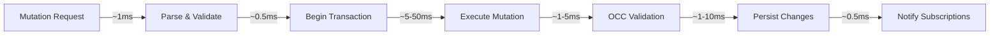

# Performance Analysis and Optimization Opportunities

**Part 7 of the Convex Backend Technical Series**

**Analysis Commit:** [`482df8a`](https://github.com/get-convex/convex-backend/tree/482df8a0e1288c9410be8241deb06b09d7ff70b0)

---

## What You'll Learn

- Current performance characteristics of Convex
- Identified bottlenecks and their causes
- Optimization opportunities with effort estimates
- Benchmarking infrastructure and metrics
- Scaling strategies and considerations

---

## Introduction

Performance isn't just about speed—it's about making efficient use of resources at scale. In this final post, we'll analyze Convex's performance profile, identify bottlenecks, and explore optimization opportunities discovered during our codebase analysis.

## Benchmarking Infrastructure

Convex uses Criterion for benchmarking:

```rust
// Example benchmark from crates/database/benches/subscriptions.rs
// https://github.com/get-convex/convex-backend/blob/482df8a0e1288c9410be8241deb06b09d7ff70b0/crates/database/benches/subscriptions.rs

use criterion::{criterion_group, criterion_main, Criterion};

fn subscription_staleness(c: &mut Criterion) {
    c.bench_function("is_stale_check", |b| {
        b.iter(|| {
            // Measure staleness check performance
            subscription.is_stale(&changes)
        })
    });
}

criterion_group!(benches, subscription_staleness);
criterion_main!(benches);
```

### Available Benchmarks

| Crate | Benchmark | What It Measures |
|-------|-----------|------------------|
| database | subscriptions | Subscription invalidation |
| database | is_stale | Staleness checking |
| indexing | index_registry | Index lookup performance |
| isolate | new_context | V8 context creation |
| packed_value | packed_value | Serialization speed |
| search | memory_index | Text search performance |
| vector | memory_index | Vector search performance |
| value | json, base32 | Value serialization |

## Current Performance Characteristics

### Read Path


- **Query latency**: 5-20ms typical
- **Throughput**: 1000s of queries/second
- **Bottleneck**: Query execution time (varies by complexity)

### Write Path



- **Mutation latency**: 10-100ms typical
- **Throughput**: 100s of mutations/second
- **Bottleneck**: Persistence write + OCC validation

### Subscription Path

- **Initial subscription**: 5-20ms
- **Update propagation**: 1-5ms after commit
- **Memory per subscription**: ~1-10KB

## Identified Bottlenecks

### 1. Search + Filter Performance

**Location:** `crates/search/src/query.rs:1011`

```rust
// TODO: Filter conditions are inefficiently searched, especially in
// conjunction with text searches. We should eventually optimize this
// simpler implementation as well.
```

**Impact:** High
**Cause:** Text search and filter conditions are evaluated separately, causing redundant work.

**Current approach:**
1. Execute text search → get candidate documents
2. For each candidate, evaluate filter
3. Return matching documents

**Optimized approach:**
1. Push filter predicates into search index
2. Combined scoring for relevance
3. Single-pass evaluation

### 2. Arc<Mutex> Contention

**Location:** `crates/usage_tracking/src/lib.rs:571-576`

```rust
// TODO: We should ideally not use an Arc<Mutex> here. The best way to
// achieve this is to move the logic for accounting ingress out of the
// Committer into the Transaction.
```

**Impact:** Medium
**Cause:** 86 instances of `Arc<Mutex>` throughout codebase

**Problems:**
- Lock contention under high concurrency
- Cache line bouncing between cores
- Unnecessary atomic operations

**Solutions:**
- Use `dashmap` for concurrent maps
- Per-thread counters with periodic aggregation
- Lock-free data structures where appropriate

### 3. Edit Distance Scoring

**Location:** Multiple files in `crates/search/`

```rust
// TODO: Come up with a smarter way to boost scores based on edit distance.
```

**Impact:** Medium
**Cause:** Current scoring is simplistic, doesn't account for typo patterns

### 4. Memory Index SIMD

**Location:** `crates/search/src/memory_index/art.rs:51`

```rust
// TODO: sort and binary search. SIMD?
```

**Impact:** Low-Medium
**Opportunity:** SIMD can accelerate string comparisons and searches

### 5. Metrics Overhead

**Location:** `crates/indexing/src/backend_in_memory_indexes.rs:650`

```rust
// TODO: This event is reporting to Honeycomb too often
```

**Impact:** Low
**Cause:** High-frequency metrics collection adds latency

## Memory Patterns Analysis

### Clone Overhead

**Finding:** 5,180 `clone()` calls

Many are necessary (shared ownership), but some could be avoided:

```rust
// Unnecessary clone
let config = self.config.clone();
process(config);

// Better: borrow if process doesn't need ownership
process(&self.config);
```

### Dynamic Dispatch

**Finding:** 600 `Box<dyn>` / `Arc<dyn>` patterns

Trade-offs:
- **Flexibility**: Multiple implementations at runtime
- **Cost**: Indirect function calls, no inlining

Consider using generics where:
- Single implementation per compilation
- Hot paths where inlining matters

## Scaling Considerations

### Vertical Scaling

Current limits:
- **Memory**: Snapshots kept in memory
- **CPU**: V8 isolates are CPU-intensive
- **Connections**: PostgreSQL connection limits

### Horizontal Scaling

Architecture supports:
- **Read replicas**: Multiple query endpoints
- **Write sharding**: By tenant/table
- **Worker distribution**: Background tasks

## Optimization Opportunities

### Quick Wins (< 1 week)

| Optimization | Effort | Impact | Location |
|-------------|--------|--------|----------|
| Reduce metrics frequency | 1 day | Low | indexing crate |
| Fix unnecessary clones | 2-3 days | Low | Various |
| Update base64 to 0.22 | 1 day | Low | Workspace deps |

### Strategic (2-4 weeks)

| Optimization | Effort | Impact | Location |
|-------------|--------|--------|----------|
| Search + filter optimization | 2 weeks | High | search crate |
| Arc<Mutex> → DashMap | 1 week | Medium | Various |
| Subscription data structure | 2 weeks | Medium | database crate |

### Long-term (> 1 month)

| Optimization | Effort | Impact | Location |
|-------------|--------|--------|----------|
| SIMD memory index | 1 month | Medium | search crate |
| Isolate pooling improvements | 3 weeks | Medium | isolate crate |
| Query plan caching | 1 month | High | database crate |

## Profiling Tools

### CPU Profiling

```rust
// Tracy integration
// Source: crates/common/src/tracing.rs
// https://github.com/get-convex/convex-backend/blob/482df8a0e1288c9410be8241deb06b09d7ff70b0/crates/common/src/tracing.rs

#[cfg(feature = "tracy")]
pub fn trace_span(name: &str) {
    tracy_client::span!(name);
}
```

### Memory Profiling

```rust
// jemalloc profiling
// https://github.com/get-convex/convex-backend/blob/482df8a0e1288c9410be8241deb06b09d7ff70b0/Cargo.toml

[dependencies]
jemalloc_pprof = "0.6"
tikv-jemallocator = "0.6"
```

### Metrics Collection

Key metrics to monitor:

```rust
// HTTP latency
HTTP_HANDLE_DURATION_SECONDS

// OCC conflicts
occ_conflicts_total

// Transaction write size
transaction_write_size_bytes

// Index size
index_size_bytes

// Subscription count
active_subscriptions
```

## Performance Testing Strategy

### Load Testing

```rust
// Source: crates/load_generator/src/main.rs
// https://github.com/get-convex/convex-backend/blob/482df8a0e1288c9410be8241deb06b09d7ff70b0/crates/load_generator/src/main.rs

pub struct LoadGenerator {
    client: ConvexClient,
    scenario: LoadScenario,
}

pub enum LoadScenario {
    // Read-heavy workload
    ReadMostly { read_ratio: f64 },

    // Write-heavy workload
    WriteMostly { write_ratio: f64 },

    // Mixed realistic workload
    Realistic { queries_per_mutation: usize },
}
```

### Simulation Testing

Deterministic simulation for finding race conditions:

```rust
// Source: crates/simulation/src/lib.rs
// https://github.com/get-convex/convex-backend/blob/482df8a0e1288c9410be8241deb06b09d7ff70b0/crates/simulation/src/lib.rs

pub struct Simulation {
    runtime: SimulationRuntime,
    seed: u64,
}

impl Simulation {
    pub fn run(&mut self) -> SimulationResult {
        // Deterministic execution
        // Can replay any failure
    }
}
```

## Recommendations

### Immediate Actions

1. **Profile production workloads**
   - Enable Tracy in staging
   - Identify actual hot paths
   - Validate assumptions

2. **Benchmark before optimizing**
   - Run existing benchmarks
   - Establish baselines
   - Measure after changes

3. **Fix low-hanging fruit**
   - Unnecessary clones
   - Metrics frequency
   - Dependency updates

### Medium-term Investments

1. **Search optimization**
   - Combined search + filter execution
   - Better scoring algorithms
   - Index pushdown

2. **Concurrency improvements**
   - Replace `Arc<Mutex>` patterns
   - Lock-free counters
   - Better cache locality

3. **Memory efficiency**
   - Reduce allocations in hot paths
   - Pool frequently created objects
   - Consider arena allocation

### Architecture Evolution

1. **Query plan caching**
   - Cache compiled queries
   - Skip parsing/planning for repeated queries

2. **Tiered storage**
   - Hot data in memory
   - Warm data on SSD
   - Cold data in object storage

3. **Adaptive indexing**
   - Auto-create indexes for common patterns
   - Drop unused indexes
   - Index recommendation engine

## Key Takeaways

1. **Profile before optimizing** - Assumptions about bottlenecks are often wrong

2. **Search + filter is the biggest win** - Clear TODO with high impact

3. **Lock contention is real** - 86 Arc<Mutex> instances add up

4. **Memory patterns matter** - 5,180 clones, 600 dynamic dispatches

5. **Good infrastructure exists** - Benchmarks, load testing, simulation ready to use

## Conclusion

Convex is a well-optimized system with thoughtful architecture. The identified bottlenecks are:

- **Well-documented** (TODOs with context)
- **Addressable** (clear optimization paths)
- **Prioritizable** (effort vs impact)

The biggest opportunities are in search performance and reducing lock contention. Both require focused effort but would benefit all users.

## Series Conclusion

Over these seven posts, we've explored:

1. **Architecture** - Layered design with clear abstractions
2. **Database** - MVCC with OCC transactions
3. **Patterns** - Runtime trait, structured errors, testing
4. **Subscriptions** - Real-time dependency tracking
5. **Isolation** - Secure V8 execution
6. **Extensions** - Storage, integrations, HTTP actions
7. **Performance** - Bottlenecks and optimizations

Convex is a sophisticated system that balances:
- **Simplicity** for developers
- **Performance** for production
- **Consistency** for correctness

We hope this series helps you understand how it works and how to contribute to its improvement.

---

## References

- [Load Generator](https://github.com/get-convex/convex-backend/blob/482df8a0e1288c9410be8241deb06b09d7ff70b0/crates/load_generator/src/main.rs)
- [Simulation Framework](https://github.com/get-convex/convex-backend/blob/482df8a0e1288c9410be8241deb06b09d7ff70b0/crates/simulation/src/lib.rs)
- [Benchmark Suites](https://github.com/get-convex/convex-backend/tree/482df8a0e1288c9410be8241deb06b09d7ff70b0/crates/database/benches)

---

*This concludes the Convex Backend Technical Series. Thank you for reading!*
