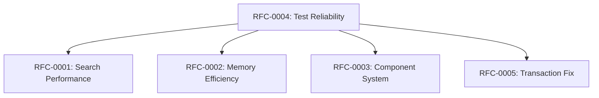

# RFC Prioritization Matrix

**Analysis Commit:** `482df8a0e1288c9410be8241deb06b09d7ff70b0`
**Date:** November 19, 2025

---

## Overview

This document prioritizes the proposed RFCs by impact and effort, helping stakeholders decide which improvements to pursue first.

## Priority Matrix

```
                    IMPACT
           Low      Medium      High
         ┌─────────┬─────────┬─────────┐
    Low  │ RFC-008 │ RFC-004 │         │
         │         │         │         │
E  ──────┼─────────┼─────────┼─────────┤
F  Med   │         │ RFC-005 │ RFC-002 │
F        │         │ RFC-007 │ RFC-003 │
O  ──────┼─────────┼─────────┼─────────┤
R  High  │         │ RFC-006 │ RFC-001 │
T        │         │         │         │
         └─────────┴─────────┴─────────┘
```

## RFC Summary Table

| RFC | Title | Category | Effort | Impact | Priority |
|-----|-------|----------|--------|--------|----------|
| RFC-0001 | Search + Filter Performance | Performance | 2 weeks | High | **P0** |
| RFC-0002 | Memory Efficiency Initiative | Performance | 1 week | Medium-High | **P1** |
| RFC-0003 | Component System Completion | Feature | 2 weeks | Medium-High | **P1** |
| RFC-0004 | Test Reliability Program | Quality | 3 days | Medium | **P2** |
| RFC-0005 | Transaction Invalidation Fix | Correctness | 1 week | Medium | **P2** |
| RFC-0006 | Secret Key Architecture | Security | 3 weeks | Medium | **P2** |
| RFC-0007 | Circular Dependency Resolution | Maintenance | 2 weeks | Medium | **P3** |
| RFC-0008 | Error Context Preservation | DX | 2 days | Low | **P3** |

## Category Distribution

### Quick Wins (< 1 week)
- **RFC-0004**: Test Reliability Program
- **RFC-0008**: Error Context Preservation

### Strategic (1-4 weeks)
- **RFC-0001**: Search + Filter Performance
- **RFC-0002**: Memory Efficiency Initiative
- **RFC-0003**: Component System Completion
- **RFC-0005**: Transaction Invalidation Fix
- **RFC-0007**: Circular Dependency Resolution

### Long-term (> 1 month)
- **RFC-0006**: Secret Key Architecture (includes rollout time)

## Recommended Order

### Phase 1: Foundation (Weeks 1-2)
1. **RFC-0004** - Fix flaky tests first (enables confident changes)
2. **RFC-0008** - Improve error handling (helps debugging)

### Phase 2: Performance (Weeks 3-6)
3. **RFC-0001** - Search + filter optimization (highest impact)
4. **RFC-0002** - Memory efficiency (reduces resource usage)

### Phase 3: Features & Correctness (Weeks 7-10)
5. **RFC-0003** - Complete component system
6. **RFC-0005** - Fix transaction invalidation edge cases

### Phase 4: Architecture (Weeks 11-16)
7. **RFC-0006** - Secret key architecture (security improvement)
8. **RFC-0007** - Circular dependency resolution (maintainability)

## Success Metrics

| RFC | Success Criteria |
|-----|------------------|
| RFC-0001 | 50% reduction in search+filter latency |
| RFC-0002 | 30% reduction in lock contention |
| RFC-0003 | All `by_component_TODO` removed |
| RFC-0004 | 0 flaky tests, all tests pass |
| RFC-0005 | Transaction invalidation correct for all operations |
| RFC-0006 | No instance secrets in function runner |
| RFC-0007 | 0 circular dependency workarounds |
| RFC-0008 | Error context preserved in all paths |

## Dependencies



RFC-0004 (Test Reliability) should be completed first as it enables confident changes for all other RFCs.

## Stakeholder Requirements

| RFC | Engineering | Product | Security | DevOps |
|-----|-------------|---------|----------|--------|
| RFC-0001 | Required | Interested | - | - |
| RFC-0002 | Required | - | - | Interested |
| RFC-0003 | Required | Required | - | - |
| RFC-0004 | Required | - | - | - |
| RFC-0005 | Required | - | Interested | - |
| RFC-0006 | Required | - | Required | Interested |
| RFC-0007 | Required | - | - | - |
| RFC-0008 | Required | Interested | - | - |

## Resource Estimate

| Phase | Duration | Engineers |
|-------|----------|-----------|
| Phase 1 | 2 weeks | 1 |
| Phase 2 | 4 weeks | 2 |
| Phase 3 | 4 weeks | 2 |
| Phase 4 | 6 weeks | 1 |

**Total: ~16 weeks with 1-2 engineers**

---

*See individual RFC documents for detailed implementation plans.*
