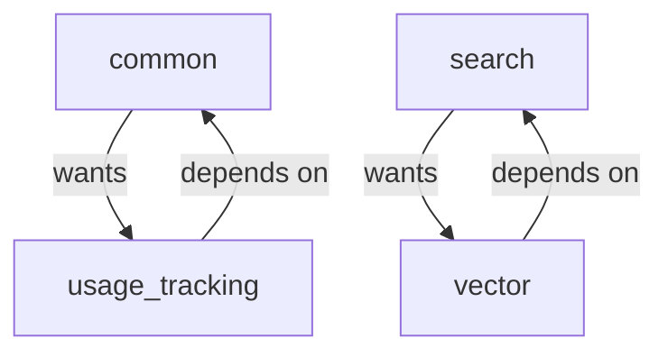

# RFC-0007: Circular Dependency Resolution

**Status:** Draft
**Author:** Claude (AI Analysis)
**Created:** November 19, 2025
**Analysis Commit:** `482df8a0e1288c9410be8241deb06b09d7ff70b0`

---

## Summary

Refactor the codebase to eliminate circular dependency workarounds that cause code duplication and maintenance burden.

## Motivation

### Identified Circular Dependencies

**Location 1:** `crates/common/src/log_streaming.rs:58`
```rust
// TODO(sarah) this is nearly identical to the type in the `usage_tracking`
// crate, but there's a dependency cycle preventing us from using it directly.
```

**Location 2:** `crates/vector/src/qdrant_index.rs`
```rust
// (circular dependency comment)
```

**Location 3:** `crates/search/src/fragmented_segment.rs`
```rust
// (circular dependency comment)
```

### Impact

- **Code duplication**: Same types defined multiple times
- **Maintenance burden**: Changes must be synchronized
- **Bug surface**: Duplicates can drift apart
- **Compile complexity**: Harder to reason about dependencies

## Detailed Design

### Analysis of Dependencies



### Resolution Strategies

#### Strategy 1: Extract Shared Types

Create a new crate for shared types:

```
crates/
  common_types/  # NEW - shared types with no dependencies
    src/
      log_streaming_types.rs
      usage_types.rs
  common/
    # Depends on common_types
  usage_tracking/
    # Depends on common_types
```

#### Strategy 2: Trait Inversion

Define traits in the lower crate, implement in higher:

```rust
// In common (lower crate)
pub trait UsageReporter: Send + Sync {
    fn report_usage(&self, usage: &dyn UsageData);
}

// In usage_tracking (higher crate)
impl UsageReporter for UsageTracker {
    fn report_usage(&self, usage: &dyn UsageData) {
        // Implementation
    }
}
```

#### Strategy 3: Event-Based Decoupling

Use events to break direct dependencies:

```rust
// In common
pub struct UsageEvent {
    pub table: String,
    pub bytes: usize,
}

// usage_tracking subscribes to events
// common emits events without knowing subscriber
```

## Implementation Plan

| Phase | Duration | Approach |
|-------|----------|----------|
| 1. common/usage_tracking | 1 week | Extract shared types |
| 2. search/vector | 1 week | Trait inversion |

## Success Criteria

- [ ] 0 circular dependency workarounds
- [ ] No duplicated types
- [ ] Clean crate DAG
- [ ] All tests pass

## Effort Estimation

**Total: 2 weeks**

---

*References:*
- [Log Streaming](https://github.com/get-convex/convex-backend/blob/482df8a0e1288c9410be8241deb06b09d7ff70b0/crates/common/src/log_streaming.rs)
